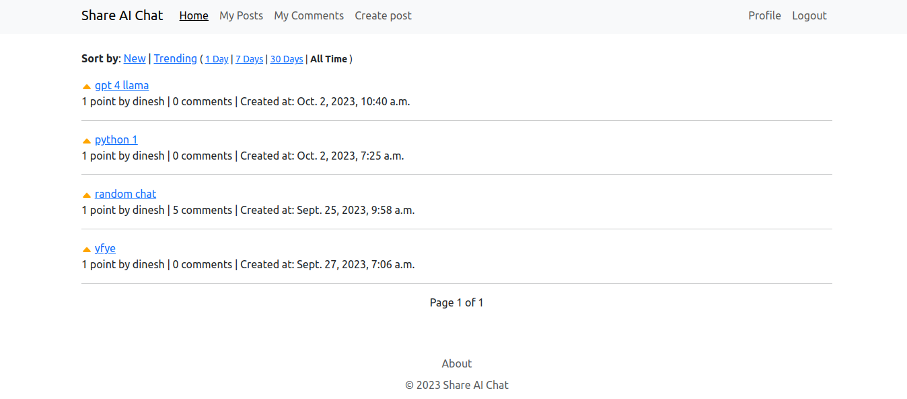
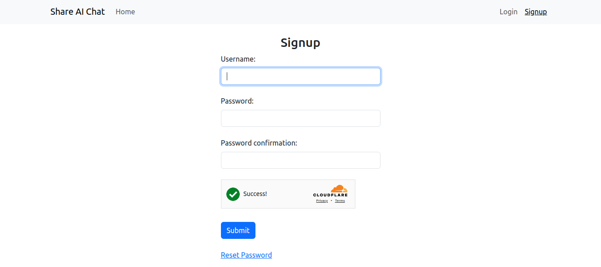
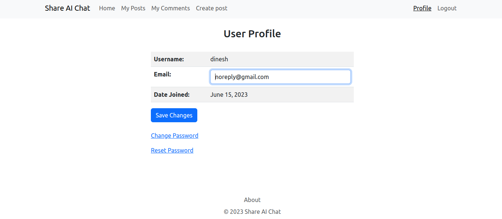
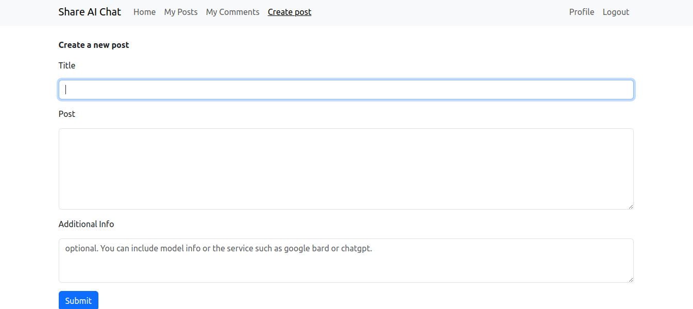
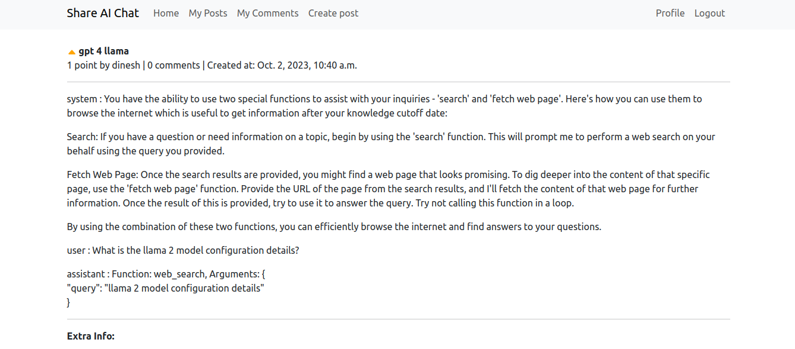
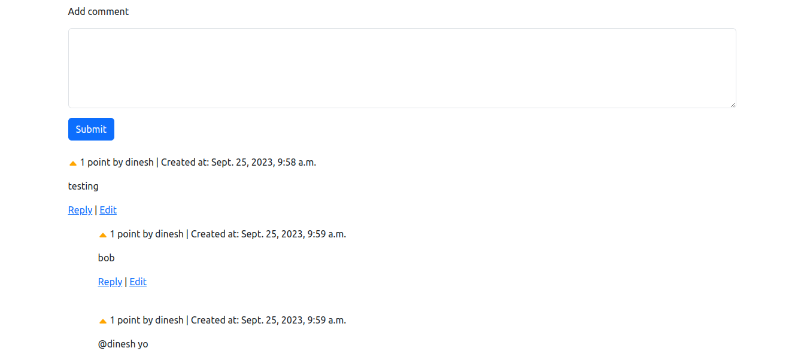

Share AI Chat is a project that enables users to share and discuss outputs from locally running large language models like Mistral and LLaMA. It serves as a forum where users can post, comment, and vote on conversations, similar to a simplified social media platform for AI enthusiasts. The platform supports direct post creation, title edits, commenting, voting, and post deletion, providing a comprehensive toolset for engaging with and managing content effectively.

# Share AI Chat setup guide

[Initial server setup guide](https://www.digitalocean.com/community/tutorials/initial-server-setup-with-ubuntu-22-04)

`sudo apt update`

`sudo apt upgrade`

`sudo reboot`

## Docker setup

[DO guide](https://www.digitalocean.com/community/tutorials/how-to-install-and-use-docker-on-ubuntu-22-04#step-1-installing-docker)

[Compose install](https://docs.docker.com/compose/install/linux/)

## Setup project

`git clone https://github.com/don-dp/shareaichat.git`

Set environment variables in `~/.bashrc`

```
export SHAREAICHAT_SECRET_KEY="your_secret_key_value"
export SHAREAICHAT_DEBUG="True_or_False"
export SHAREAICHAT_ALLOWED_HOSTS="your_allowed_hosts"
export SHAREAICHAT_DEFAULT_FROM_EMAIL="your_default_email"
export SHAREAICHAT_EMAIL_BACKEND="your_email_backend"
export SHAREAICHAT_EMAIL_HOST="your_email_host"
export SHAREAICHAT_EMAIL_PORT="your_email_port"
export SHAREAICHAT_EMAIL_USE_TLS="True_or_False"
export SHAREAICHAT_EMAIL_HOST_USER="your_email_user"
export SHAREAICHAT_EMAIL_HOST_PASSWORD="your_email_password"
export SHAREAICHAT_TURNSTILE_SECRET_KEY="your_turnstile_secret_key"
export SHAREAICHAT_POSTGRES_USER="your_postgres_user"
export SHAREAICHAT_POSTGRES_PASSWORD="your_postgres_password"
export SHAREAICHAT_POSTGRES_DB="your_postgres_db"
export SHAREAICHAT_ENV="prod_or_dev"

```

`source ~/.bashrc`

`cd shareaichat`

Edit `Caddyfile` to replace `mydomain.com` with your domain name.

`docker compose up -d`

`sudo ufw allow 80`

`sudo ufw allow 443`

Update the `Caddyfile` for local testing if required:

```
:80 {
    reverse_proxy web:8000
    encode gzip
    file_server /static/* {
        root /static
    }
    # Optional: Enable access logs for local testing
    log {
        output stdout
    }
}
```

These are images from a deployment of the project, providing a glimpse into the user interface and functionality:

### Homepage


### Signup Page


### Profile Page


### Create Post


### Post View


### Comments Section


To run the tests, ensure the application is running using docker compose, then run the following command:

`docker compose exec web python manage.py test`
